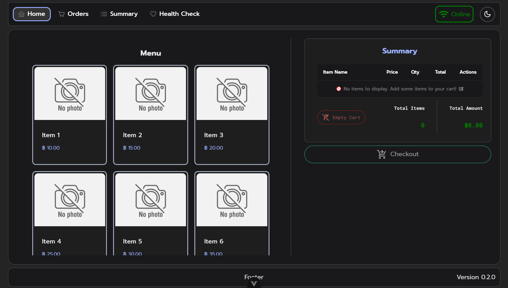

# PromPOS - Modern Point of Sale System

[](https://vuejs.org/)
[](https://firebase.google.com/)
[](https://vitejs.dev/)
[](https://primevue.org/)

A modern, responsive Point of Sale (POS) system built with Vue.js 3 and Firebase, designed for small to medium businesses. Features real-time order management, offline functionality, and comprehensive sales analytics.

🌐 **Live Demo**: [https://prom-pos.web.app/](https://prom-pos.web.app/)

### 🎯 For HR & Recruiters

**Guest Access Available!** No registration required - simply click "Continue as Guest" to explore all features immediately. Perfect for quick evaluation and testing.



## 🚀 Features

### 💰 Core POS Functionality

- **Real-time Order Management** - Add, remove, and modify items with instant calculations
- **Multiple Payment Methods** - Support for cash payments and QR code (PromptPay) transactions
- **VAT Calculation** - Automatic 7% VAT calculation and breakdown
- **Receipt Generation** - Digital receipts with order details and payment information

### 📊 Sales Analytics & Reporting

- **Daily Sales Summary** - Real-time sales data with payment method breakdown
- **Transaction Analytics** - Average sales per transaction, min/max values, and standard deviation
- **Category-based Sales** - Sales breakdown by product categories (Drinks, Bakery, etc.)
- **Date Range Filtering** - Historical data analysis with flexible date selection

### 🌐 Cloud Integration & Offline Support

- **Firebase Firestore** - Real-time cloud database synchronization
- **Offline Functionality** - Continue operations without internet connection
- **Auto-sync** - Automatic order synchronization when connection is restored
- **Data Persistence** - Local storage backup for uninterrupted service

### 📱 Modern UI/UX

- **Responsive Design** - Works seamlessly on desktop, tablet, and mobile devices
- **PrimeVue Components** - Professional UI components with consistent design
- **Dark/Light Mode** - Theme switching capability
- **Progressive Web App** - Installable as a native app experience

## 🛠 Technology Stack

### Frontend

- **Vue.js 3** - Progressive JavaScript framework with Composition API
- **Vite** - Next-generation frontend build tool
- **PrimeVue 4** - Comprehensive UI component library
- **Pinia** - State management with persistence
- **Vue Router** - Client-side routing

### Backend & Database

- **Firebase Firestore** - NoSQL cloud database
- **Firebase Functions** - Serverless backend functions
- **Firebase Hosting** - Static web hosting

### Additional Libraries

- **QRCode.js** - QR code generation for PromptPay payments
- **PromptPay QR** - Thai payment system integration
- **Day.js** - Lightweight date manipulation library

## 📋 Prerequisites

- Node.js (v16 or higher)
- npm or yarn package manager
- Firebase account and project setup
- Modern web browser

## ⚙️ Installation & Setup

1. **Clone the repository**

   ```bash
   git clone https://github.com/ThePonpanit/PromPOS-1.git
   cd PromPOS-1
   ```

2. **Install dependencies**

   ```bash
   npm install
   ```

3. **Environment Configuration**

   ```bash
   # Copy the example environment file
   cp .env.example .env

   # Edit .env with your Firebase configuration
   # Get these values from your Firebase project settings
   ```

4. **Firebase Setup**

   - Create a Firebase project at [Firebase Console](https://console.firebase.google.com/)
   - Enable Firestore Database
   - Enable Firebase Hosting (optional)
   - Copy your Firebase configuration to `.env` file

5. **Development Server**

   ```bash
   npm run dev
   ```

6. **Production Build**
   ```bash
   npm run build
   ```

## 🔧 Configuration

### Environment Variables

Configure your Firebase project by setting these environment variables in `.env`:

```env
VITE_APP_VERSION=0.5.3

# Firebase Configuration
VITE_FIREBASE_API_KEY=firebase_api_key
VITE_FIREBASE_AUTH_DOMAIN=project.firebaseapp.com
VITE_FIREBASE_PROJECT_ID=project-id
VITE_FIREBASE_STORAGE_BUCKET=project.firebasestorage.app
VITE_FIREBASE_MESSAGING_SENDER_ID=messaging_sender_id
VITE_FIREBASE_APP_ID=firebase_app_id
VITE_FIREBASE_MEASUREMENT_ID=measurement_id
```

### PromptPay Configuration

Update the PromptPay account number in `src/components/main/CheckoutButton.vue`:

```javascript
const promptpayAccount = "0804920305"; // Replace with your PromptPay number
```

## 📁 Project Structure

```
src/
├── components/          # Reusable Vue components
│   ├── main/           # Core POS components (checkout, summary)
│   ├── orders/         # Order management components
│   └── OrderSync.vue   # Offline/online synchronization
├── stores/             # Pinia state management
│   └── useMenuStore.js # Main application state
├── views/              # Page components
├── router/             # Vue Router configuration
├── firebase/           # Firebase configuration
└── assets/             # Static assets

functions/              # Firebase Cloud Functions
public/                 # Static public assets
```

## 🎯 Key Features Demonstration

### Order Management

- Interactive product selection with quantity controls
- Real-time price calculations and VAT breakdown
- Shopping cart functionality with item management

### Payment Processing

- **Cash Payments**: Amount input with change calculation
- **QR Payments**: Automatic PromptPay QR code generation
- Payment validation and receipt generation

### Data Analytics

- Real-time sales dashboard
- Payment method distribution analysis
- Product category performance tracking
- Transaction statistics and trends

### Offline Capability

- Automatic detection of network status
- Local order storage when offline
- Background synchronization when online
- Conflict resolution and data integrity

## 🚢 Deployment

### Firebase Hosting

```bash
# Build and deploy to Firebase
npm run deploy:all

# Deploy to production
npm run deploy:hosting:prod

# Deploy to development
npm run deploy:hosting:dev
```

### Manual Deployment

```bash
# Build for production
npm run build

# Deploy the dist/ folder to your preferred hosting service
```

## 🧪 Development Scripts

```bash
# Development server with hot reload
npm run dev

# Production build
npm run build

# Preview production build
npm run preview

# Deploy to Firebase (all services)
npm run deploy:all

# Deploy only hosting
npm run deploy:hosting:all
```

## 📈 Performance & Best Practices

- **Lazy Loading** - Route-based code splitting for optimal loading
- **State Persistence** - Offline-first architecture with local storage
- **Error Handling** - Comprehensive error handling and user feedback
- **Security** - Environment-based configuration for sensitive data
- **Responsive Design** - Mobile-first approach with adaptive layouts

## 🤝 Contributing

This project was developed as a demonstration of modern web development skills and best practices. It showcases proficiency in:

- Vue.js 3 Composition API
- State management with Pinia
- Firebase integration and real-time data
- Responsive UI/UX design
- Progressive Web App development
- Modern JavaScript/ES6+ features

## 📧 Contact

**Developer**: ThePonpanit  
**Project Repository**: [PromPOS-1](https://github.com/ThePonpanit/PromPOS-1)

---

_This project demonstrates advanced frontend development skills, cloud integration expertise, and modern web application architecture suitable for enterprise-level applications._
